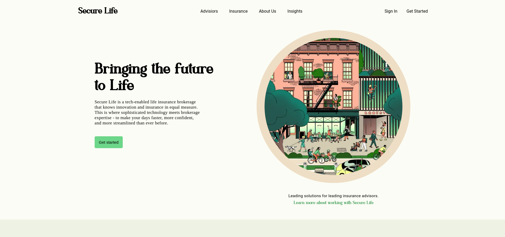

# Secure Life

Secure Life is a tech-enabled life insurance brokerage that knows innovation and insurance in equal measure.

## [Live Preview](https://malihassandev.github.io/Secure-Life/)

## Features
- Responsive Design
- Fully adaptive layout across desktop, tablet, and mobile devices
- WCAG compliant color contrast
- Brand Integration
- Consistent brand color scheme implementation
## Tech Stack
- Html 
- Javascript
- Css
## Outcome
- Implemented brand-consistent typography and design system to strengthen visual identity.
- Established consistent visual hierarchy to guide users through key insurance offerings.
- Incorporated trust-building elements like client testimonials and company credentials.
## Navigation
- My next project [Breakout](https://github.com/MAliHassanDev/Break-Out-Game)
- My previous project [To-Do](https://github.com/MAliHassanDev/To-Do-List)